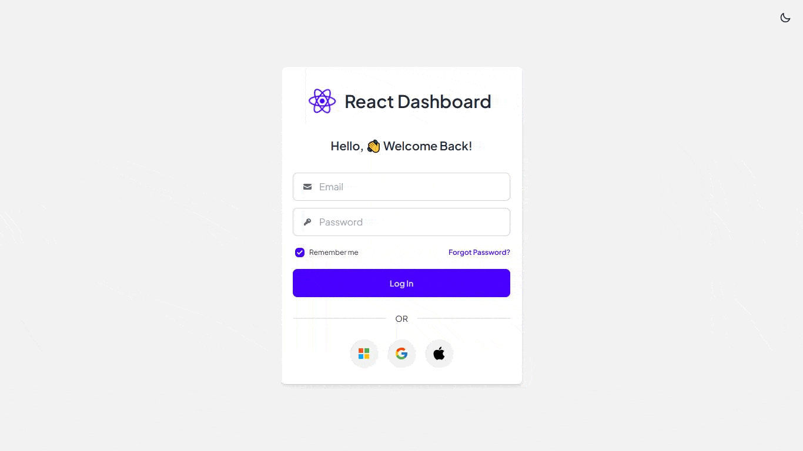

<br/>
<p align="center">
    <a href="https://react-admin-ui-v1.vercel.app/" target="_blank">
        
    </a>
</p>

<br/>
<p align="center">
    <a href="LICENSE" target="_blank"></a>
    <a></a>
    <a></a>
    <a></a>
    <a></a>
</p>
<br/>

[React Admin UI](https://react-admin-ui-v1.vercel.app/) is a beautiful and open-source **Dashboard User Interface Prototype** built with TypeScript and React based. Surprisingly, this is my first time building a User Interface prototype with a bit complex components. So, my goal is IT agencies or even individual developers could use this prototype to brings insight for their future projects.

Have a look at the preview of [React Admin UI](https://react-admin-ui-v1.vercel.app/) for a comprehensive list of prototype's features, core values and use cases.

<br/>
<p align="center">
    
</p>
<br/>

This repository contains the **core system of React Admin UI Prototype**, splitted into two different directories. Backend is for the JSON API (It is already configured for Vercel deployment), and Frontend is for the whole User Interface prototype.

## 💎&nbsp; Features and Consist of

- ⚡️ React 18 TypeScript with Vite
- 🎯 Declarative Routing with React Router v6
- 📋 Seamless Data Fetching with React Query v5
- ✨ Optimized Icons with React Icons v5
- 🎨 Tailwind CSS v3 as the Styling Foundation
- 👓 Daisy UI v4 as the Base Design System
- 🕶 Material UI v5 for optimized Data Grid
- 📊 Beautiful Charts with Recharts v2
- 🤯 And many more...

## 🚀&nbsp; Installation and How to use

See below for a quickstart installation and usage examples.

<details open>
<summary>Backend</summary>

Install all dependencies listed in `package.json` inside backend directory.

```bash
cd backend
```

```bash
npm install
```

By default, I already deployed the API to run in Vercel environment. The live API can be accessed from [https://react-admin-ui-v1-api.vercel.app/](https://react-admin-ui-v1-api.vercel.app/). However, in case you would like to configure the backend by yourself, you can run below.

```bash
nodemon ./src/index.ts
```

And the API can be accessed locally from [http://localhost:5000](http://localhost:5000).

</details>

<details open>
<summary>Frontend</summary>

Install all dependencies listed in `package.json` inside frontend directory.

```bash
cd frontend
```

```bash
npm install
```

```bash
npm run dev
```

If you would like to change the default API endpoint, you can go to [ApiCollection.tsx](/frontend/src/api/ApiCollection.tsx).

And then, the app can be accessed from [http://localhost:5173/](http://localhost:5173/).

</details>

## 📫&nbsp; Have a question? Would like to chat? Ran into a problem?

Obviously you can always **reach out to me directly** via a formal approach such as [Email](mailto:franswinata6@gmail.com) or [LinkedIn](https://www.linkedin.com/in/fransachmadhw/).

## 🤝&nbsp; Found a bug? Suggesting a specific feature?

Feel free to **file a new issue** with a respective title and description on the the [fransachmadhw/react_admin_ui_v1](https://github.com/fransachmadhw/react_admin_ui_v1/issues) repository. If you already found a solution to your problem, **we would love to review your pull request**!

## ✅&nbsp; Requirements

React Admin UI requires a **Node version higher or equal to 20.11.0 LTS**. Have a look at the `dependencies` and `devDependencies` section in the _package.json_ inside [backend](/backend/package.json) and [frontend](/frontend/package.json) to find the **current list of the requirements** of React Admin UI.

## 📘&nbsp; License

React Admin Dashboard UI Prototype is released under the terms of the [BSD-3-Clause](LICENSE).
